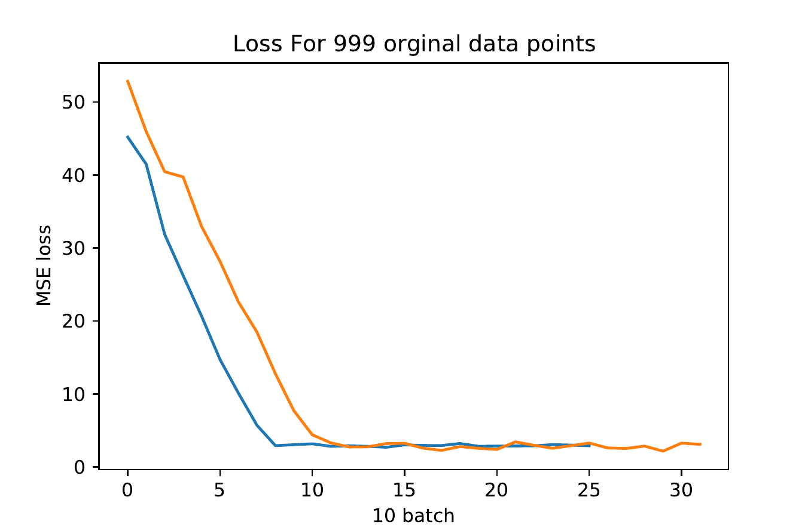

# MarkRNN
A deep learning model to predict gades given the answer(text) and a marking scheme.

# Model - 2

It takes the marking scheme first and uses the Encode_mark network to convert it into a hidden vector of 512 dimensions.Thus Encoder_mark outputs a (64,512) tensor [64 for the batch size]. Expanding the dimension and repeating it 'd' times, it is converted to a (64,d,512) tensor. The Answer for each case is set to a length of 'd' using padding. This is now embedded using an embedding layer to [64,d,256]. Both the tensors are concatenated to form a [64,d,768] shape tensor. This is used as an input for a bi-directional LSTM. Followed by 2 dense layers and final output of shape [64,1]

# Data
https://github.com/mahnazkoupaee/WikiHow-Dataset 

<Refer to this link to get the dataset used>

I have used the WikiHow Dataset that contains Heading(question) Summary(marking scheme) and long answer(answer) for articles. Considering these as the perfect grade 10. I have produced lower grades from these using data augmentation. For an Answer a probability 'p' for each sentence to be taken or ignored and grade set to p*10. Thus if the answer has approximately 50% of the perfect answer based on untampered marking scheme it is graded 5.

#Loss

Train and Validation Loss for 999 data points

Train and Validation Loss for 9999 data points(First 100 batches are ignored)

Train Loss for 9999 data points.(First 100 batches are ignored)
